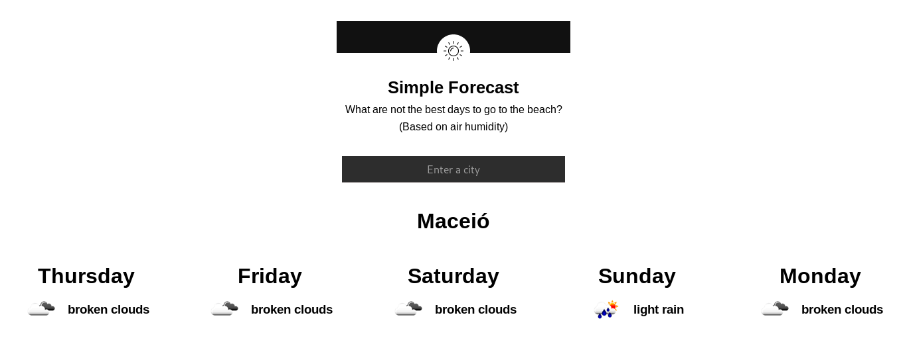

# Weather Mini Challenge
> Shows days not to go to the beach, based on humidity




## Development run
Create a copy of the .env.example file and rename it to .env, now insert your [APY_KEY](https://openweathermap.org/appid) in the .env file.
Then install the dependencies and run the project:

```sh
yarn install
yarn dev
```

The application is available at: http://localhost:5000

## Deployment

With Docker Compose installed, run:

```sh
docker-compose up -d --build
```

The application is available on port 5000.
